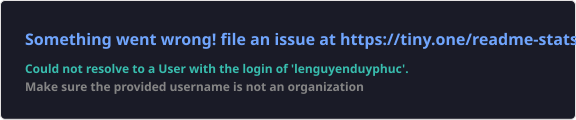

  
  
  
  

   

  
  
  

   

  

## About

- **SWE Intern @ Microsoft** — Fabric Real-Time Intelligence, Redmond WA
- **SWE Intern @ Guardiane (USF)** — grant-funded child-safety app, ML + federated learning
- **B.S. Computer Science, Minor in Mathematics** @ USF Judy Genshaft Honors College · **3.98 GPA** · May 2028
- **Uber Career Prep Fellow** (top 4%) · **Google Developers Group Tech Lead** · CodePath · UR2PhD

## Experience Highlights

**Microsoft** · Software Engineer Intern, RTI IQ Unified Experiences · *Summer 2026*
- Built the end-to-end **Multivariate Anomaly Detector** UI for **14+ detection models** in React, TypeScript, FluentUI and TanStack Query
- Shipped real-time **Kusto dashboards** tracking **12+** Azure monitoring and billing metrics
- Supported **GA of Fabric Operations Agents** for **500+ enterprise customers**

**Guardiane @ USF** · Software Engineer Intern · *May 2025 – May 2026*
- Cross-platform grant-funded mobile app, lifting predator-risk detection **+90%** with federated learning
- Fine-tuned **Qwen3-4B** on **150K+** records, pushing classification accuracy **40% → 90%**
- Engineered a **multi-agent classroom** (React · FastAPI · MongoDB · OpenAI) with **6+** tool-calling personas

## Featured Projects

| Project | Highlight | Stack |
|---|---|---|
| **[ToastTutor](https://github.com/ttrang87/toast-tutor)** | K–12 tutoring platform — Redis caching cut response time **5ms → 1ms**, CI/CD deploys in **38s** | `Django` `React` `Redis` `Supabase` `Docker` |
| **[FinBud](https://github.com/finbud2024/Finbud)** | LLM financial advisor for Vietnamese speakers — RAG over DeepSeek-V3, **200+** concurrent users | `LangGraph` `Vue.js` `MongoDB` `Puppeteer` |
| **[DeStress](https://github.com/phucle2k6/DeStress)** | Mental-health chatbot on a fine-tuned **Qwen2.5-0.5B** (TRL SFTTrainer, 2K+ conversations) | `React` `Express` `Flask` `Hugging Face` |
| **[Nano_GPT](https://github.com/phucle2k6/Nano_GPT)** | GPT built from scratch — attention, tokenization and training loop implemented by hand | `PyTorch` `Python` |

## Tech Stack

**Languages**

&nbsp;
&nbsp;
&nbsp;
&nbsp;
&nbsp;

**Frontend**

&nbsp;
&nbsp;
&nbsp;
&nbsp;
&nbsp;

**Backend & AI**

&nbsp;
&nbsp;
&nbsp;
&nbsp;
&nbsp;
&nbsp;

**Data, Cloud & DevOps**

&nbsp;
&nbsp;
&nbsp;
&nbsp;
&nbsp;
&nbsp;
&nbsp;
&nbsp;
&nbsp;

## GitHub Stats

 

<h2> Contribution Snake</h2>

<picture>
  <source media="(prefers-color-scheme: dark)" srcset="https://raw.githubusercontent.com/phucle2k6/lenguyenduyphuc/output/github-contribution-grid-snake-dark.svg"/>
  <source media="(prefers-color-scheme: light)" srcset="https://raw.githubusercontent.com/phucle2k6/lenguyenduyphuc/output/github-contribution-grid-snake.svg"/>
  
</picture>

